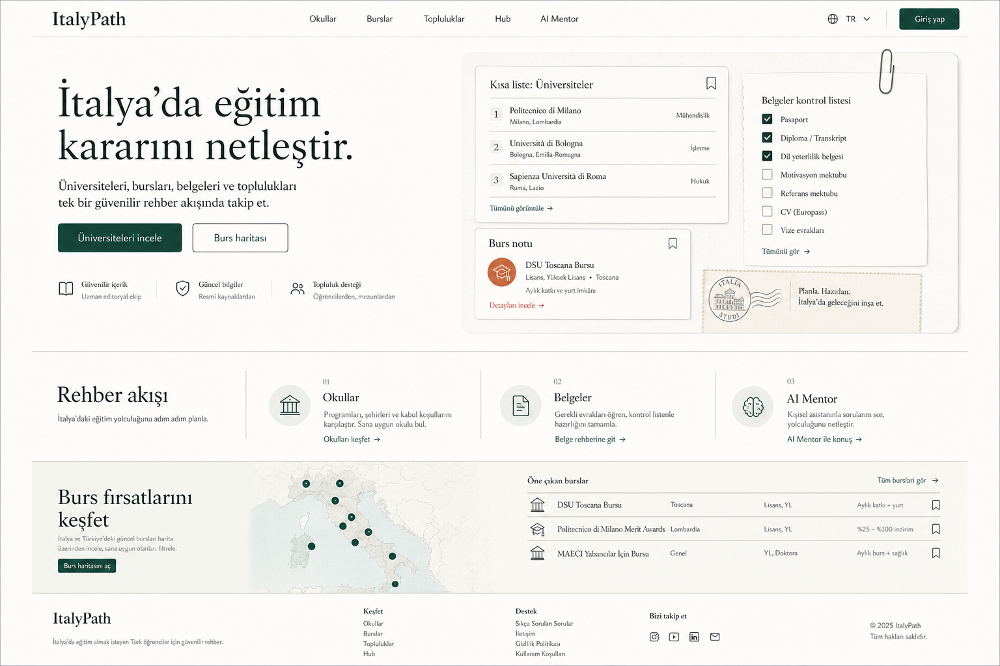

# ItalyPath Editorial UI Redesign

Date: 2026-05-10
Status: Approved visual direction, pending implementation plan

Accepted concept:

## Goal

ItalyPath should stop feeling like a generic AI/SaaS landing page and start feeling like a serious, human-designed education guide for Turkish students and families planning study in Italy. The new UI direction is **Editorial Guide**: calm, trustworthy, structured, warm, and product-useful.

## Problems To Remove

- Neon gradient headlines and dominant purple/blue SaaS styling.
- Glassmorphism, glow blobs, bokeh/orb backgrounds, animated sparkle motifs, and pulsing CTAs.
- Over-rounded bento cards and repeated floating-card compositions.
- Excessive badges, pills, fake social proof, and “AI magic” visual language.
- Heavy `font-black`/ultra-bold hierarchy where quieter editorial type would work better.

## Visual System

Palette:

- Paper background: `#f8f7f1` or true white, used deliberately.
- Ink text: `#15201c`.
- Muted body text: `#59645f`.
- Sage accent: `#1f4f46`.
- Terracotta micro-accent: `#b75b38`.
- Borders: `#d8ded9`.

Typography:

- Use the existing system font stack; no remote font dependency.
- Headings should be large, confident, and editorial, with restrained tracking.
- Body copy should be readable and calm.
- Labels should be small and quiet, not loud uppercase marketing badges.

Geometry and containers:

- Prefer open page sections, rails, lists, and paper-like blocks.
- Cards may exist for repeated items, but radii should be around `8px` to `12px`.
- Avoid nested cards and giant rounded section wrappers.
- Use thin borders and subtle shadows only when they clarify layering.

Motion:

- Keep Framer Motion for gentle entrance and route transitions.
- Remove decorative loops from the homepage: pulsing CTA, blob floating, marquee branding, sparkle status effects.
- Respect existing reduced-motion patterns.

## Scope

Primary implementation surface:

- `components/Navbar.tsx`
- `components/HeroSection.tsx`
- `components/FeaturesSection.tsx`
- `components/ScholarshipsSection.tsx`
- `components/IseeSection.tsx`
- `components/VelocityBridge.tsx`
- `components/Footer.tsx`
- `components/BottomNav.tsx`
- relevant global tokens/utilities in `app/globals.css`

Secondary alignment if implementation remains contained:

- First viewport of `app/universities/page.tsx`, especially filters, cards, and loading/empty states.
- Avoid rewriting protected workflows unless a shared component change naturally affects them.

Out of scope for this pass:

- PWA manifest and icon work, per project note.
- New product features.
- Data model, auth, Supabase, Clerk, or AI backend behavior.
- Full redesign of every protected detail page.

## Homepage Design

Header:

- Keep the ItalyPath wordmark simple and ink-colored.
- Navigation should be quiet, text-first, and slightly denser.
- Login/language controls should look like product controls, not promotional pills.

Hero:

- Use the headline: `İtalya’da eğitim kararını netleştir.`
- Supporting copy: `Üniversiteleri, bursları, belgeleri ve toplulukları tek bir güvenilir rehber akışında takip et.`
- Primary CTA: `Üniversiteleri incele`.
- Secondary CTA: `Burs haritası`.
- Replace gradient text, hero badge, stat row, sparkle footnote, mouse-follow gradient, and blobs with a two-column editorial composition.
- Right side should be a code-native study dossier: shortlist rows, document checklist, and scholarship note. It should feel like useful product material, not a fake dashboard.

Feature section:

- Replace bento grid with three horizontal editorial rows: universities, documents, AI Mentor.
- Each row should have a small icon, clear title, concise description, and a quiet action link.
- Avoid animated decorative backgrounds.

Scholarships and ISEE:

- Use calm bands and list/map/calculator motifs.
- Remove large gradients, decorative blur blobs, sparkle notes, and oversized rounded CTA panels.
- Keep clear CTAs and the existing route targets.

Velocity bridge:

- Remove or replace the repeated scrolling ItalyPath marquee. It reads as decorative filler.
- If a bridge remains, make it a quiet editorial divider with concise product proof.

Footer:

- Use a sober editorial footer with the wordmark, short purpose statement, and existing social labels as muted non-links.

Mobile:

- Bottom nav should become flatter and more native: thin top border, quiet active state, no glowing central AI button.
- Maintain four destinations: home, universities, AI Mentor, hub/profile.
- Keep safe-area handling.

## Accessibility And Interaction

- Preserve semantic links and buttons.
- Maintain `aria-label` and `aria-pressed` where already used.
- Keep focus-visible states clear with sage/ink accents.
- Avoid text overlap on narrow screens; use stable dimensions for dossier rows and mobile nav controls.

## Verification

Required checks after implementation:

- `npm run lint`
- `npm run build`
- Browser/IAB visual pass on desktop and mobile.
- Screenshot comparison against the accepted concept image.
- Above-the-fold copy diff: no unapproved hero badges, pills, sparkle notes, or fake social proof should remain.

