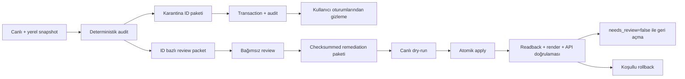

# Tasarım: SAT Soru Metni İyileştirme ve Güvenli Patch Sistemi

Tarih: 2026-08-28

Durum: Kullanıcı tarafından yön seçimi onaylandı; yazılı spec harici agent ve
kullanıcı incelemesinde

## Yönetici Özeti

ItalyPath SAT Math bankasındaki bazı soru metinleri ve şıklar, eski PDF → görsel
→ JSON çıkarma sürecinde resmî matematik gösterimi yerine erişilebilirlik/OCR
ifadeleriyle kaydedildi. Örnekler arasında `comma`, formül içi `close`,
`fractionwithnumerator`, `anddenominator`, `fofx`, `endsubscript`, `squared` ve
bozuk LaTeX komutları bulunuyor.

Seçilen çözüm, bütün bankaya toplu metin değiştirme veya yeniden import uygulamak
değildir. Sistem şu dört güvenceyi birlikte kuracaktır:

1. Şüpheli sorular inceleme tamamlanana kadar kullanıcı oturumlarından çıkarılır.
2. Her soru resmî formatted PDF görüntüsü ve resmî cevap anahtarıyla ID bazında
   incelenir; başka bir soru aynı işlem nedeniyle değişmez.
3. Canlı güncellemeler eski değer eşleşmesi, tek transaction, DB audit kaydı,
   yerel salt-okunur backup ve koşullu rollback ile uygulanır.
4. Doğrulayıcı ve genel banka importer'ı sertleştirilerek aynı bozulmanın tekrar
   canlıya taşınması engellenir.

İlk hızlı iyileştirme otomatik işaretlenen kayıtları düzeltir. Nihai “banka temiz”
kabulü ise 1.019/1.019 canlı sorunun resmî kaynakla tek tek karşılaştırılmasını
gerektirir; otomatik tarama tek başına sessiz semantik hataları kanıtlayamaz.

## Problem ve Doğrulanmış Kök Neden

### Veri akışı

Mevcut Math akışı şöyledir:

```text
Formatted PDF
  → soru görüntüsü (`tmp/sat-bank/math-images/<id>.png`)
  → agent/LLM transkripsiyonu (`tmp/sat-bank/math-questions/*.json`)
  → yapısal doğrulama (`scripts/sat/validate-bank.mjs`)
  → üretilmiş `tmp/sat-bank/bank.json`
  → geniş `id` upsert'i (`scripts/sat/import-bank.mjs`)
  → Supabase `sat_questions`
  → protected API
  → `MathText` / KaTeX
```

`slice-math.mjs` soru metnini OCR ile çıkarmadı; yalnızca PDF sayfasından ID
bazlı görüntü kesti. Bozuk metin, görüntünün JSON'a aktarıldığı agent/LLM
transkripsiyon sınırında üretildi veya korundu.

`validate-bank.mjs` şu kontrolleri yaptı: gerekli alanlar, dört dolu MCQ şıkkı,
SPR/MCQ cevap tipi, cevap anahtarı varlığı, dengeli `$` sınırlayıcıları ve figure
dosyası. Erişilebilirlik kelimeleri, bilinmeyen LaTeX komutları, KaTeX strict
uyarıları, XML artığı ve resmî görüntüyle semantik eşitlik kontrol edilmedi.

`import-bank.mjs`, doğrulamadan geçen bütün bankayı 500'lük gruplarla `id`
üzerinden upsert etti. Prompt ve şıklar dönüştürülmeden canlıya taşındı.
`MathText` sorunun kaynağı değildir; KaTeX hatasında ham metne düşerek bazı veri
hatalarını görünür kılar, bazı semantik olarak bozuk ama parse edilebilir ifadeleri
ise doğal olarak ayırt edemez.

### 2026-08-26 salt-okunur audit tabanı

Bu sayılar tasarımın başlangıç ölçümüdür; uygulama başladığında aynı taramalar
yeniden çalıştırılıp yeni run manifestinde dondurulacaktır:

- Yerel `bank.json`: 1.019 soru
- Canlı `sat_questions`: 1.019 soru
- Yerel ve canlı temel soru alanları arasında fark: 0
- Belirgin erişilebilirlik/serialization marker'ı taşıyan soru: 161
- Mevcut UI KaTeX ayarlarıyla parse hatası veren soru: 35
- Yukarıdaki iki kümenin birleşimi: 185
- KaTeX strict uyarıları da dahil geniş inceleme kümesi: 219
- Bu adaylarda canlı `needs_review=true` kaydı: 0

Raporlanan 141 kayıt geçerli fakat muhafazakâr bir alt kümedir. Başlangıç
karantinası sabit 141 veya 219 sayısına hard-code edilmeyecek; güncel canlı
snapshot üzerinde deterministik tarama sonucu üretilecektir.

## Amaçlar

1. Kullanıcıların bozuk veya güvenilmez sorularla karşılaşmasını hızlıca durdurmak.
2. Her düzeltmeyi resmî source ID, PDF görüntüsü ve cevap anahtarıyla kanıtlamak.
3. Bir patch'in yalnız açıkça listelenen ID ve alanları değiştirebilmesini sağlamak.
4. Eşzamanlı veya beklenmeyen canlı değişiklikte yazmayı tamamen reddetmek.
5. Uygulanmış her değişiklik için hem DB içi hem Git dışı geri dönüş kaydı tutmak.
6. Stale yerel bankanın ileride geniş upsert ile düzeltmeleri geri bozmasını önlemek.
7. Nihai olarak 1.019 soruluk bankanın tamamı için kaynak-sadakat belgesi üretmek.
8. Soru içeriği taşıyabilen figure görsellerinin public Storage URL'lerinden
   anonim alınmasını durdurmak.

## Kapsam Dışı

- Toplu string replacement veya regex ile otomatik içerik düzeltme
- Soruyu sadeleştirme, çevirme ya da resmî kaynakta olmayan metin ekleme
- Yeni SAT sorusu üretme
- Reading and Writing içeriğini yeniden çıkarmak
- SAT UI tasarımını değiştirmek
- Doğru cevap değişikliğini bu normal remediation akışında uygulamak
- Mevcut öğrenci denemelerini silmek veya sessizce yeniden notlandırmak
- Korumalı SAT soru içeriklerini Git geçmişine eklemek

Doğru cevap resmî anahtar veya bağımsız çözümle çelişirse kayıt bloklanır. Cevap
değişikliği, `sat_attempts` etkisini de tanımlayan ayrı tasarım ve kullanıcı onayı
gerektirir.

## Değerlendirilen Yaklaşımlar

### 1. Toplu kelime dönüşümü

Örnek: `comma → ,`, `close → )`, `squared → ^{2}`.

Reddedilme nedeni: Token sınırları ve matematik gruplaması sorudan soruya değişir.
Bir kelimenin silinmesi doğru parantezi, işareti veya üs kapsamını kanıtlamaz.
KaTeX'te parse edilen fakat matematiksel olarak yanlış çıktı üretilebilir.

### 2. Bütün 1.019 soruyu sıfırdan yeniden extract edip tam import

Reddedilme nedeni: Doğru olan yaklaşık 800 kaydı da yeniden transkripsiyon
riskine sokar, yeni farkların kaynağını belirsizleştirir ve geniş importer'ın
korumasız overwrite davranışını sürdürür.

### 3. Dosya tabanlı koşullu patch importer'ı

Mevcut 213 authored-explanation importer'ındaki proje pinleme, checksum, dry-run,
backup ve koşullu rollback desenini genelleştirir.

Tek başına seçilmedi: Güçlüdür fakat çok satırlı yazımın bütünlüğü ve uzun vadeli
audit izi operatör makinesindeki backup'a fazla bağımlı kalır.

### 4. İşlemsel DB patch sistemi + dosya paketi + karantina

Seçilen yaklaşım budur. Dosya paketi içerik/provenance/QA sözleşmesini, Postgres
fonksiyonu atomik compare-and-swap ve DB audit izini, `needs_review` ise canlı
karantinayı sağlar. Yerel backup ikinci savunma katmanıdır.

## Değişmez Güvenlik Kuralları

1. Normal banka importer'ı mevcut bir ID'nin içeriğini güncelleyemez.
2. Hiçbir canlı yazı başarılı dry-run olmadan başlayamaz.
3. Patch paketindeki her ID'nin beklenen eski snapshot'ı canlıyla eşleşmelidir.
4. Bir hedef uyuşmazsa bütün batch transaction'ı geri alınır; kısmi başarı yoktur.
5. Patch yalnız allowlist'teki alanları değiştirebilir.
6. `correct_answer`, `id`, section/domain/skill metadata'sı, `source_file`,
   `figure_path` ve `created_at` normal remediation'da değişmez.
7. Karantinadan çıkış için kaynak, cevap, açıklama ve render kapılarının tamamı
   geçmiş olmalıdır.
8. Extractor/düzeltici kendi kaydını onaylayamaz; bağımsız reviewer gerekir.
9. LLM bir düzeltme taslağı üretebilir fakat otomatik apply kararı veremez.
10. Rollback, canlı satır hâlâ uygulanmış `after` snapshot'ına eşitse çalışır;
    eşzamanlı değişikliği ezmez.
11. Service-role/secret anahtarları yalnız server/operasyon ortamında kalır ve
    hiçbir `NEXT_PUBLIC_*` değişkenine veya client koduna girmez.
12. Canlı içerik, backup ve review paketleri Git'e commit edilmez.
13. `service_role`, var olan `sat_questions` satırlarında doğrudan `UPDATE` veya
    `DELETE` yetkisi taşımaz; değişiklik yalnız dar yetkili patch fonksiyonundan
    geçer.
14. Public Storage bucket veya tahmin edilebilir anonim figure URL'si kalmaz.
15. Karantina revision'ı doğrulanamıyorsa sistem eski soruyu sunmak yerine SAT
    soru API'sinde fail-closed davranır.
16. Browser `sat_attempts` tablosuna doğrudan yazamaz; kullanıcı, doğruluk ve
    timestamp alanları protected server route tarafından üretilir.

## Mimari



Sistem yedi bağımsız parçadan oluşur.

### 1. İçerik audit aracı

Yeni audit aracı yerel bankayı ve istenirse salt-okunur canlı snapshot'ı tarar.
Çıktısı düzeltme değildir; yalnız review kuyruğudur.

Kontroller:

- Erişilebilirlik/serialization marker aileleri:
  - `comma`
  - formül sonu/gruplama bağlamındaki `close`
  - `fofx`, `gofx`, `hofx`, `pofc` benzeri function speech
  - `thefraction`, `numerator`, `denominator`, `endfraction`
  - `raisedto`, `thepower`, `powerclose`, `endpower`
  - root, set, point, subscript ve XML artıkları
- Mevcut `MathText` ile birebir KaTeX parse kontrolü
- KaTeX `strict: "error"` ikinci kontrolü
- Dengeli delimiter ve escaped currency sözleşmesi
- Bilinmeyen/yanlış birleşmiş LaTeX komutları (`\timesy`, `\pir`, `\neqb` gibi)
- Boş/eksik MCQ şıkları ve SPR cevap biçimi
- `needs_review` ile içerik riskinin uyumu

Çıktılar:

```text
tmp/sat-bank/remediation/<run-id>/audit-report.json
tmp/sat-bank/remediation/<run-id>/candidate-ids.json
tmp/sat-bank/remediation/<run-id>/live-baseline.json
```

Her aday için ID, eşleşen kural, alan (`prompt` veya choice), kaynak dosya,
zorluk, soru tipi ve mevcut içerik hash'i kaydedilir. Doğal İngilizce `closest`,
`closely` veya “meters per second squared” gibi içerik geniş substring kuralıyla
yanlış pozitif yapılmaz.

### 2. Canlı karantina

`needs_review` artık bilgi amaçlı bir bayrak değil, runtime güvenlik sınırı olur.

- Server soru sorgusu yalnız `needs_review=false` satırları getirir.
- İlk rollout'ta geniş 219-aday sınıfı güncel audit ile yeniden hesaplanır.
- Bu hedefler tek checksummed `quarantine` paketiyle
  `needs_review: false → true` yapılır.
- Karantina içerik, cevap, açıklama veya öğrenci attempt satırlarını değiştirmez.
- Kaynağa bakıldığında doğru olduğu kanıtlanan false-positive kayıtlar, değişmeyen
  içerik ve tamamlanmış QA kanıtıyla normal remediation run'ında geri açılır.

Karantina uygulanmadan önce runtime filtresi production'a deploy edilir. Böylece
DB bayrağı aktive edildiği anda davranış tanımlıdır.

#### Açık tarayıcı oturumu ve attempt politikası

Server karantinası tek başına yeterli değildir; mevcut client cache'leri process
boyunca süresiz yaşayabilir. Bu nedenle:

- Topic ve question API yanıtları `contentRevision` taşır.
- SAT client'ı sayfa görünürken en geç 60 saniyede bir ve her
  `visibilitychange`/window focus olayında küçük revision endpoint'ini doğrular.
- Revision değişince topic/question cache'leri temizlenir ve aktif oturum yeniden
  yüklenir.
- Aktif soru yeni listede yoksa cevap gönderimi durdurulur, soru kartı kapatılır
  ve kullanıcı güvenli biçimde konu görünümüne döndürülür.
- Tarihsel attempt satırları silinmez veya yeniden yazılmaz.
- Global streak/XP mevcut bütün tarihsel attempt'leri saymaya devam eder.
- Karantinadayken per-topic mastery, çözülmüş soru ve yanlışlar hesapları yalnız
  sunulabilir question ID'lerini kullanır. Aynı ID geri açıldığında tarihsel
  attempt otomatik olarak konu hesaplarına yeniden dahil olur.
- Karantina sonrası aynı ID için yeni attempt insert'i DB tarafından reddedilir.

Son kural yalnız client kontrolüne bırakılmaz. `sat_attempts` üzerinde
`BEFORE INSERT` trigger'ı hedef `sat_questions.needs_review=false` değilse
exception üretir. Trigger helper'ı `sat_attempt_guard NOLOGIN NOINHERIT` rolüne ait,
`SECURITY DEFINER`, `search_path=''` ve tüm adları schema-qualified olur; doğrudan
execute yetkisi `PUBLIC`, `anon` ve `authenticated` rollerinden revoke edilir.
Bu rol yalnız `sat_questions(id, needs_review)` kolonlarını okuyabilir; başka
tablo DML yetkisi yoktur. Trigger, `service_role` ile yapılan insert'lerde de
çalışır. Kullanıcının kendi tarihsel attempt'lerini okuma RLS policy'si ayrıca
korunur.

Browser'ın mevcut doğrudan `sat_attempts` insert yolu kaldırılır:

- `authenticated` rolünden `INSERT` revoke edilir ve doğrudan insert policy'si
  kaldırılır; kendi attempt'lerini `SELECT` etme policy'si korunur.
- Yeni `app/api/sat/attempts/route.ts` Clerk oturumunu ve body schema'sını
  doğrular. Client yalnız `questionId` ve `selectedAnswer` gönderir.
- Route sunulabilir soruyu server-side okur, ortak answer matcher ile
  `is_correct` değerini kendisi hesaplar, `user_id`yi Clerk kimliğinden ve
  `answered_at`ı server saatinden üretir; client'ın doğruluk/user/timestamp
  beyanına güvenmez.
- `service_role`, `sat_attempts` için yalnız server'ın gerektirdiği `SELECT` ve
  `INSERT` yetkisini taşır; `UPDATE`, `DELETE` ve `TRUNCATE` revoke edilir.
- Read ile insert arasındaki karantina yarışını trigger kapatır ve sabit
  `SAT_QUESTION_UNAVAILABLE` hata kodu/mesajı üretir. Route bunu
  `409 Question unavailable` yanıtına çevirir; client optimistic kaydı geri alır,
  cevabı doğru/yanlış veya XP olarak saymaz, revision refresh yapar ve topic
  görünümüne döner.

### 3. Private figure delivery

Mevcut `sat-figures` bucket'ı soru/grafik içeriği taşıyabildiği için public
olamaz. Migration bucket'ı private yapar ve anonim object read'i kaldırır.

- Soru API'si public Storage URL üretmez.
- `app/api/sat/figures/[questionId]/route.ts`, Clerk oturumunu doğrular,
  `questionId` için sunulabilir (`needs_review=false`) satırı server-side kontrol
  eder, görseli service-role ile private bucket'tan indirir ve response olarak
  proxy eder. Browser'a Storage object key'i veya signed URL verilmez.
- Figure yanıtı `Cache-Control: private, no-store, max-age=0` taşır; mevcut
  objelerin uzun Storage cache metadata'sına güvenilmez.
- Karantinadaki veya bilinmeyen ID için route `404` döndürür.
- Normal banka importer'ı existing Storage objelerinde `upsert` kullanmaz.
  Bütün mevcut ID ve object hash preflight'ı herhangi bir Storage yazısından önce
  tamamlanır; mevcut object farklıysa bütün import yazısız fail eder.
- Bucket üzerindeki authenticated doğrudan object-read policy'leri kaldırılır;
  Storage'a erişebilen tek uygulama yüzeyi protected route'tur.
- Kabul testi, anonim Storage object URL'sinin başarısız ve authenticated protected
  route'un başarılı olduğunu doğrular.

### 4. ID bazlı review packet

Her soru için aşağıdaki kaynak paketi mekanik olarak hazırlanır:

```json
{
  "id": "856372ca",
  "source": {
    "question_pdf": "Question Bank (Formatted)/Math/.../Circles 2.pdf",
    "question_image": "tmp/sat-bank/math-images/856372ca.png",
    "answer_key_pdf": "Question Bank (Formatted)/Answers/Math/Circles 2~Key.pdf",
    "pdf_sha256": "...",
    "image_sha256": "..."
  },
  "current": {
    "prompt": "...",
    "choices": {"A": "...", "B": "...", "C": "...", "D": "..."},
    "correct_answer": ["B"],
    "explanation_en": "...",
    "needs_review": true
  },
  "candidate_reasons": ["accessibility-token", "katex-parse"],
  "review_status": "pending"
}
```

Review packet doğrudan değişiklik paketi değildir. Reviewer resmî soru görüntüsü,
resmî answer-key ve canlı açıklamayı aynı ekranda/packet'ta görmelidir.

### 5. Remediation paket sözleşmesi

Review'dan geçen küçük batch, aşağıdaki dosyalarla paketlenir:

```text
target-ids.json
patches.json
reviews.json
run-manifest.json
qa-report.json
SHA256SUMS
```

`patches.json` kaydı:

```json
{
  "id": "856372ca",
  "expected_before": {
    "section": "math",
    "domain": "Geometry and Trigonometry",
    "skill": "Circles",
    "skill_slug": "circles",
    "difficulty": 2,
    "question_type": "mcq",
    "prompt": "...bozuk mevcut metin...",
    "choices": {"A": "...", "B": "...", "C": "...", "D": "..."},
    "correct_answer": ["B"],
    "figure_path": null,
    "explanation_tr": null,
    "explanation_en": "...",
    "source_file": "Circles 2.pdf",
    "created_at": "<live-created-at>",
    "needs_review": true
  },
  "proposed_after": {
    "section": "math",
    "domain": "Geometry and Trigonometry",
    "skill": "Circles",
    "skill_slug": "circles",
    "difficulty": 2,
    "question_type": "mcq",
    "prompt": "...resmî kaynağa sadık düzeltilmiş metin...",
    "choices": {"A": "...", "B": "...", "C": "...", "D": "..."},
    "correct_answer": ["B"],
    "figure_path": null,
    "explanation_tr": null,
    "explanation_en": "...",
    "source_file": "Circles 2.pdf",
    "created_at": "<live-created-at>",
    "needs_review": false
  },
  "editable_fields": ["prompt", "choices", "needs_review"],
  "source_evidence": {
    "question_pdf_sha256": "...",
    "question_image_sha256": "...",
    "answer_key_pdf_sha256": "..."
  },
  "qa": {
    "source_fidelity": "passed",
    "official_answer": "passed",
    "independent_solution": "passed",
    "explanation_consistency": "passed",
    "katex_default": "passed",
    "katex_strict": "passed",
    "visual_render": "passed",
    "writer": "<writer-task-id>",
    "reviewer": "<review-task-id>"
  }
}
```

Kurallar:

- `expected_before` ve `proposed_after`, `id` dışındaki bütün canlı soru
  kolonlarını taşıyan tam row snapshot'ıdır; eksik alanla merge yapılmaz.
- RPC karşılaştırması `to_jsonb(locked_row) - 'id'` üzerinden yapılır. İleride
  yeni kolon eklenir ve paket builder güncellenmezse key-set eşitliği bozulur;
  apply sessizce alan atlamak yerine fail eder.
- Karşılaştırma otoritesi Node/Postgres arasında değişebilen string hash değildir.
  RPC önce payload key-set'ini canlı row key-set'iyle exact karşılaştırır, sonra
  JSON'u `jsonb_populate_record(NULL::public.sat_questions, ...)` ile DB tiplerine
  dönüştürür ve composite row'u `IS NOT DISTINCT FROM` ile karşılaştırır. Böylece
  timestamp serialization farkı yanlış stale sonucu üretmez; JSONB alanlar da
  DB semantiğiyle karşılaştırılır. Hash'ler paket ve audit bütünlüğü içindir.
- Function gerçek farkı hesaplar ve `editable_fields` dışındaki değişikliği
  reddeder.
- `correct_answer` iki snapshot'ta birebir aynı olmalıdır.
- `explanation_en` yalnız resmî rationale veya onaylı authored source ile açık
  çelişki bulunursa editable olabilir; ilgili explanation source paketi aynı
  run'da güncellenir ve provenance kaybolmaz.
- Her paket hedef ID listesi, kaynak PDF'ler, audit tabanı, prompt/reviewer
  sözleşmesi ve tüm içerik dosyaları için SHA-256 taşır.
- Checksum bütünlük kanıtıdır; dijital imza gibi sunulmaz.
- `SHA256SUMS`, kendisi dışındaki paket dosyalarını byte düzeyinde, normalize
  edilmiş göreli yol sırasıyla hash'ler. `package_sha256`, bu deterministik
  `SHA256SUMS` dosyasının SHA-256 değeridir; circular/self hash yoktur.
- Package builder JSON anahtar sırası, ID sırası, UTF-8 encoding ve final newline
  sözleşmesini sabitler; aynı girdiler aynı byte/hash çıktısını üretir.

Çalışma paketi `tmp/sat-bank/remediation/` altında, kalıcı teslim paketi ise
`SAT_REMEDIATION_ARCHIVE_ROOT` ile belirlenen Git dışı korumalı alanda tutulur.
Apply komutu kalıcı archive hedefi ayarlı ve yazılabilir değilse başlamaz.
CLI archive root'un realpath'inin repo worktree'si dışında olduğunu, directory
mode'unun grup/world erişimine kapalı olduğunu ve package destination'ın yeni
olduğunu doğrular.

### 6. Supabase işlemsel patch ve audit katmanı

#### Audit tabloları

Korumalı, Data API'ye expose edilmeyen `private` şemasında iki tablo bulunur:

`private.sat_question_patch_runs`

- `run_id uuid primary key`
- `kind text`: `quarantine` | `remediation`
- `package_sha256 text unique`
- `source_bank_sha256 text`
- `target_count int`
- `status text`: `applied` | `rolled_back`
- `metadata jsonb`
- `created_at`, `applied_at`, `rolled_back_at`

`private.sat_question_patch_items`

- `run_id uuid references ...`
- `question_id text`
- `before_payload jsonb`
- `after_payload jsonb`
- `before_sha256 text`
- `after_sha256 text`
- `source_evidence jsonb`
- `qa_evidence jsonb`
- primary key `(run_id, question_id)`

Bu tablolar korumalı SAT içeriğini taşıdığı için anon/authenticated erişimi yoktur.
Private şema API exposed-schemas listesine eklenmez. RLS defense-in-depth olarak
açık kalır; client policy tanımlanmaz. `PUBLIC`, `anon` ve `authenticated` için
schema/table yetkileri açıkça revoke edilir.

Audit izi service key ile değiştirilemez: `service_role`, `private` schema veya
audit tablolarında doğrudan hiçbir yetki almaz. CLI readback'i yalnız dar public
read RPC'si üzerinden yapar. Audit DML'i aşağıda tanımlanan `NOLOGIN` fonksiyon
sahibi rol üzerinden yapılabilir. Audit tablolarının sahibi migration/admin
rolüdür; `sat_patch_executor` tablo sahibi yapılmaz ve owner bypass kazanmaz.

#### Cache revision tablosu

`public.sat_bank_state` fiziksel olarak tek satır olabilen metadata tablosudur:

```sql
id boolean primary key default true check (id),
content_revision bigint not null default 1 check (content_revision >= 1),
last_run_id uuid,
updated_at timestamptz not null default timezone('utc', now())
```

Boolean primary key ile `check (id)` yalnız `true` satırına izin verir; ikinci
satır üretilemez. Migration `id=true, content_revision=1` satırını idempotent
olarak seed eder. Fonksiyon bu satırı `FOR UPDATE` kilitler; satır yoksa veya
beklenen tek satır okunamıyorsa exception üretir.

`PUBLIC`, `anon` ve `authenticated` bütün tablo yetkilerini kaybeder. Server
`service_role` yalnız `SELECT`; fonksiyon sahibi rol yalnız `SELECT` ve
`UPDATE(content_revision, last_run_id, updated_at)` alır. Patch transaction'ı
revision'ı aynı transaction içinde artırır.

Server, üç saatlik tam banka memo'suna ek olarak en fazla 60 saniyelik bir
revision lease'i tutar:

- Lease geçerliyken aynı revision'a ait tam banka cache'i sunulabilir.
- Lease yenilemesi başarılı ve revision değişmemişse cache güvenlidir; tam banka
  refresh'i gerekmez.
- Revision değişmişse yeni bankanın tamamı yüklenmeden eski cache sunulmaz.
- Revision okuması lease dolduktan sonra başarısızsa SAT soru endpoint'i `503`
  döner; stale bank sunmaz.

Client, son doğrulanmış revision zamanını ayrıca izler. 60 saniyelik lease
doğrulanamıyorsa aktif soruyu ve cevap gönderimini geçici olarak kilitler. Böylece
karantina hem server hem açık tarayıcı oturumunda en geç 60 saniyelik üst sınıra
sahiptir; ağ/metadata arızası güvenlik garantisini gevşetmez.

#### Apply ve rollback fonksiyonları

Data API üzerinden çağrılabilmesi için üç RPC `public` şemasında bulunur:

- `public.apply_sat_question_patch(jsonb)`
- `public.rollback_sat_question_patch(uuid)`
- `public.get_sat_question_patch_run(uuid)`

Güvenlik sözleşmesi:

- Migration `sat_patch_executor NOLOGIN NOINHERIT` rolünü oluşturur. Bu rol
  `sat_questions` üzerinde yalnız `SELECT` ve kolon bazlı
  `UPDATE(prompt, choices, explanation_en, needs_review)`; audit tablolarında
  gereken `SELECT`/`INSERT` ve run status kolonlarında dar `UPDATE`; state
  tablosunda yukarıdaki dar `SELECT`/`UPDATE` yetkilerini alır. `DELETE`,
  `TRUNCATE`, korumalı kolon update'i veya login yetkisi almaz.
- `sat_patch_executor` private schema için yalnız `USAGE` alır; schema `CREATE`
  veya table ownership almaz. `sat_patch_executor` ve `sat_attempt_guard` public
  schema için explicit `USAGE` alır, `CREATE` almaz. `service_role` private schema
  `USAGE` dahi almaz.
- `SECURITY DEFINER` RLS'yi kendiliğinden bypass etmediği için migration dar,
  role-targeted policy'leri explicit oluşturur. `sat_patch_executor`,
  `sat_questions` için `SELECT`/`UPDATE`; audit tabloları için gereken
  `SELECT`/`INSERT` ve yalnız runs tablosunda dar `UPDATE`; singleton state için
  `SELECT`/`UPDATE` policy'lerini alır. `sat_attempt_guard`, `sat_questions` için
  yalnız `SELECT` policy'si alır.
- Question/audit policy'leri bu iki kapalı role `USING (true)` ve gereken yerde
  `WITH CHECK (true)` verir; state policy'si `id=true` ile sınırlıdır. Satır
  seçimini sabit function gövdesi, kolon sınırını kolon grant'leri zorlar. Bu
  roller hiçbir client/service rolüne member olarak verilmez ve `BYPASSRLS`
  almaz.
- Üç public RPC `SECURITY DEFINER`dır ve sahibi `sat_patch_executor` rolüdür.
  Bu istisna, çağıran `service_role`a tablo DML'i vermeden dar bir DB güvenlik
  sınırı kurmak için bilinçli olarak seçilmiştir.
- Her RPC `search_path=''` kullanır; bütün type, function, operator ve relation
  referansları schema-qualified yazılır. Dynamic SQL kullanılmaz.
- Fonksiyonların varsayılan `PUBLIC` execute yetkisi ile `anon` ve
  `authenticated` execute yetkileri revoke edilir; yalnız `service_role`
  `EXECUTE` alır.
- `service_role`, `sat_questions` üzerinde yalnız mevcut server read akışının
  gerektirdiği `SELECT` ve yeni-ID importer'ı için `INSERT` taşır. Etkin
  `UPDATE`/`DELETE`/`TRUNCATE` yetkisi yoktur; migration testi bunu
  `has_table_privilege` ve gerçek DML denemesiyle kanıtlar.
- Run türü ve değiştirilebilir alan allowlist'i fonksiyon içinde hard-code edilir.
  Caller'ın `editable_fields` dizisi yetki kaynağı değildir; DB gerçek diff'i
  hesaplar ve declared diff ile aynı olmasını ister.
- `remediation` run'ında zorunlu QA anahtarlarının tümü `passed`, writer ve
  reviewer dolu/farklı, `expected_before.needs_review=true` ve
  `proposed_after.needs_review=false` olmalıdır.
  `quarantine` run'ı yalnız `false → true` bayrak farkına izin verir.
- Read RPC yalnız verilen tek run'ın metadata/item JSON'unu döndürür; listeleme,
  filtrelenmemiş içerik dump'ı veya DML yapmaz.
- Yeni public objelerin platform varsayılan grant'lerine güvenilmez; table,
  sequence ve function yetkileri explicit tanımlanır. Service-role key yalnız
  server-side operasyon scriptinde kullanılır.

Apply fonksiyonu tek transaction içinde:

1. Aynı anda iki remediation run'ı çalışmasın diye transaction-scoped advisory
   lock alır.
2. Run ID, package hash ve hedef ID tekilliğini doğrular.
3. Her hedefin canlı snapshot'ını `FOR UPDATE` kilitler.
4. Key-set doğrulamasından sonra bütün `expected_before` değerlerini typed
   composite row eşitliğiyle karşılaştırır.
5. Run türüne göre DB içindeki hard-coded değiştirilebilir alanları doğrular.
6. `correct_answer` ve diğer korumalı alanların değişmediğini doğrular.
7. Bütün run/item audit satırlarını yazar.
8. Hedef soru satırlarını günceller.
9. `sat_bank_state.content_revision` değerini artırır.
10. Uygulanmış snapshot ve revision döndürür.

Herhangi bir adım exception üretirse Postgres bütün işlemi, henüz yazılmış run ve
item satırları dahil geri alır. Başarısız apply için DB'de sahte bir kalıcı run
vaat edilmez; CLI package hash'i, hata sınıfı, timestamp ve hedef ID'lerle
`failed-run-report.json` dosyasını Git dışı archive'a yazar. Başarıyla commit
edilmiş item kayıtları append-only kalır; run kaydının yalnız rollback
status/timestamp kolonları rollback RPC'si tarafından değiştirilebilir. Hiçbiri
silinemez.

Rollback fonksiyonu:

1. Run'ı ve status=`applied` durumunu kilitler; yalnız `kind=remediation`
   run'larını kabul eder.
2. Her hedefin canlı snapshot'ını audit'teki `after_payload` ile karşılaştırır.
3. Tek uyuşmazlıkta hiçbir satırı değiştirmez.
4. Bütün hedefleri `before_payload` değerlerine döndürür.
5. Run status'ünü `rolled_back` yapar ve revision'ı artırır.

Audit satırları rollback'te silinmez.

`quarantine` run'ı generic rollback ile geri açılamaz. Yanlış-pozitif bir hedef
ancak içeriği değişmese bile bütün QA kapılarını taşıyan `remediation` run'ıyla
`needs_review=true → false` yapılabilir. Böylece recovery komutu şüpheli soruyu
kazara tekrar görünür kılmaz.

### 7. Operasyon CLI'ı ve genel importer koruması

Yeni operasyon CLI'ı şu modları taşır:

```text
audit
build-review-packets
validate-package
dry-run
apply --package-sha256 <hash>
rollback --run-id <uuid>
verify-live --run-id <uuid>
apply-to-local-source
```

`dry-run`:

- Beklenen production Supabase project URL/ref'ini pinler.
- Tam canlı soru ID kümesini sayfalı okur.
- Hedeflerin mevcut snapshot/hash eşleşmesini doğrular.
- Non-target soru hash özetini kaydeder.
- Package checksum, reviewer ve bütün QA kapılarını yeniden doğrular.
- DB yazısı, Storage yazısı veya local source değişikliği yapmaz.

`apply` başlamadan önce `O_EXCL` ile yeni path'te mode `0600` yerel backup üretir,
dosya ve parent directory `fsync` sonrası backup'ı mode `0400` yapar; mevcut bir
backup path'ini asla overwrite etmez.
RPC dönüşünden sonra hedefler ve revision yeniden okunur. Non-target soru özeti
değişmişse run başarılı ilan edilmez. Uygulama sonrası doğrulama başarısız olur ve
canlı hedefler hâlâ `after_payload` ile eşleşirse CLI, remediation run'ında
koşullu rollback çağırır. Quarantine run'ında hedefler güvenli biçimde gizli
kalır; failure report ve operatör müdahalesi gerekir.

`apply-to-local-source`, aynı package'ı önce geçici bir kopyada raw
`math-questions` shard'larına uygular ve `bank.json` yeniden üretim/doğrulamasını
çalıştırır. Canlı apply başarılı olduktan sonra doğrulanmış staging çıktısı yerel
source'a terfi ettirilir. Run; raw shard, üretilmiş bank, canlı row ve kalıcı
archive aynı `after` hash'lerini göstermeden tamamlanmış sayılmaz.

Mevcut `import-bank.mjs` şu şekilde değiştirilir:

- Varsayılan davranış dry-run + insert-only olur.
- Var olan bir ID'nin herhangi bir alanı farklıysa importer hata raporu üretir.
- `upsert` ile mevcut soruyu overwrite eden normal yol kaldırılır.
- Existing-ID güncellemesi yalnız remediation CLI'ı üzerinden yapılabilir.
- `sat-figures` bucket'ını `public:true` oluşturan yol ve Storage
  `upsert:true` kaldırılır. Yeni görseller private bucket'a immutable object key
  ve `upsert:false` ile yazılır.
- DB veya Storage yazısından önce bütün question ID'leri, object key'leri ve
  indirilen object SHA-256 değerleri preflight edilir. Mevcut key farklı içerik
  taşıyorsa run tamamen durur; aynı içerik taşıyorsa yeniden yazılmaz.
- Yeni upload başarılı fakat DB insert başarısız olursa yalnız bu run'ın ürettiği
  referanssız immutable objeler manifestte işaretlenir; otomatik geniş delete
  yapılmaz. Ayrı, checksum korumalı cleanup operasyonu gerekir.
- Empty-table disaster restore ayrı, açıkça isimlendirilmiş ve ayrıca onaylanan bir
  operasyon olur; normal import flag'i olarak saklanmaz. Yalnız DB'nin gerçekten
  boş olduğu kanıtlanırsa ve girdi final 1.019-ledger/hash teslimiyle eşleşirse
  çalışır.

Mevcut doğrudan açıklama DML yolları da bu sınırı delmemelidir:

- `scripts/sat/import-explanations.mjs` ile
  `scripts/sat/import-authored-explanations.mjs` içindeki doğrudan apply/restore
  modları ve `.from("sat_questions").update(...)` helper'ları kaldırılır.
- Paket oluşturma ve salt-okunur doğrulama yetenekleri korunabilir; existing-ID
  explanation ekleme/değiştirme/rollback işlemleri aynı remediation RPC'si,
  provenance ve QA sözleşmesinden geçer.
- `scripts/check-sat-bank.mjs`, operasyon scriptlerinde `sat_questions` için
  doğrudan `update`, `upsert` veya `delete` çağrısının yeniden eklenmesini CI'da
  reddeder.

## İçerik İnceleme Süreci

### Pilot

Önce 12 soruluk deterministik pilot yapılır. Pilot şu çeşitliliği kapsar:

- `comma` + coordinate
- `close` + parantez
- fraction speech
- function speech
- exponent/root speech
- set/point/subscript artığı
- XML artığı
- KaTeX undefined control sequence
- escaped currency / percent
- Unicode geometri sembolü
- MCQ ve SPR
- Dört Math domain'i ve zorluk 1/2/3
- Varsa figure taşıyan en az bir soru

Pilotun her kaydı bağımsız review, render ve answer doğrulamasından geçmeden
sonraki batch başlamaz. Pilot canlıya tek atomik run olarak uygulanır ve en geç
60 saniye sonra API/UI üzerinden tekrar doğrulanır.

### Hızlı remediation dalgaları

Pilot kabulünden sonra geniş 219-aday küme 15–25 ID'lik batch'lere ayrılır.
Batch'ler source PDF/shard sahipliğine göre gruplanır; aynı shard'da iki aktif
writer bulunmaz.

Her ID için:

1. Mevcut içerik ve kaynak hash'leri dondurulur.
2. Writer formatted soru görüntüsünü birebir LaTeX/metne aktarır.
3. Resmî answer-key ID'si ve cevabı mekanik olarak eşleştirilir.
4. Ayrı bir reviewer soruyu bağımsız çözüp answer-key sonucuyla karşılaştırır.
5. Canlı `explanation_en`, düzeltilmiş prompt/şıklara karşı okunur.
6. Default ve strict KaTeX, ardından gerçek `MathText` görsel kontrolü yapılır.
7. Reviewer kabul ederse package'a girer; reddederse somut notla correction
   kuyruğuna döner.
8. Başka bir reviewer correction'ı tekrar kontrol eder.

### Tam banka doğrulaması

Otomatik marker taşımayan yaklaşık 800 kayıt “temiz” kabul edilmez; yalnız düşük
riskli sayılır. Nihai kaynak-sadakat kabulü için kalan bütün sorular da source PDF
shard'ları halinde aynı görsel karşılaştırmadan geçer.

Bu ikinci dalgada içerik farkı bulunmazsa yalnız `review` kanıtı üretilir. Fark
bulunursa soru karantinaya alınır ve normal remediation paketine döner.

Bu işin “1.019 soru bakıldı” beyanına dönüşmemesi için inceleme mekanik bir
ledger ile kapanır. İlk review başlamadan önce Git dışı archive'da
`source-inventory.json` üretilir; bütün formatted soru/answer PDF'lerinin göreli
yolu, byte size'ı ve SHA-256 değeri dondurulur. `slice-math.mjs` tarafından
üretilen `math-manifest.json` kalıcı olarak şu provenance alanlarını taşır:

- question ID
- source PDF göreli yolu ve SHA-256 değeri
- 1-based PDF sayfası ve sayfa içindeki soru sırası
- review crop göreli yolu ve SHA-256 değeri
- answer-key PDF göreli yolu, SHA-256 değeri, sayfası ve resmî cevap

`full-review-ledger.json` tam 1.019 benzersiz kayıt taşır. Her kayıtta en az şu
alanlar vardır:

```json
{
  "id": "856372ca",
  "baseline_payload_sha256": "...",
  "source": {
    "pdf": "...",
    "pdf_sha256": "...",
    "page_1based": 12,
    "ordinal_on_page": 3,
    "crop_sha256": "..."
  },
  "answer_key": {
    "pdf": "...",
    "pdf_sha256": "...",
    "page_1based": 4,
    "official_answer": ["B"]
  },
  "final_payload_sha256": "...",
  "writer": "<task-id>",
  "reviewer": "<different-task-id>",
  "verdict": "approved",
  "reviewed_at": "<ISO-8601>",
  "qa": {
    "source_fidelity": "passed",
    "official_answer": "passed",
    "independent_solution": "passed",
    "explanation_consistency": "passed",
    "visual_render": "passed"
  }
}
```

Final validator, ledger ID kümesinin dondurulmuş 1.019 canlı baseline ID kümesiyle
birebir aynı olduğunu; duplicate, pending/rejected kayıt veya aynı writer/reviewer
olmadığını; source checksum'larının inventory ile, `final_payload_sha256`
değerlerinin final local bank ve canlı DB ile eşleştiğini doğrular. PDF checksum'ı
değişirse etkilenen bütün review kayıtları geçersiz sayılır ve yeniden incelenir.

## Soru Başına Kabul Sözleşmesi

Bir soru ancak aşağıdakilerin tamamı sağlanırsa `needs_review=false` olabilir:

### Kaynak sadakati

- ID, source PDF ve soru görüntüsü doğrudan eşleşiyor.
- Prompt İngilizce kaynakla aynı anlam ve sırada.
- A/B/C/D şıkları kaynakla birebir eşleşiyor.
- Kaynakta olmayan graph/alt-text açıklaması prompt'a eklenmemiş.
- Değişken, işaret, parantez, mutlak değer, kök ve üs kapsamı görselle aynı.
- Figure gerekiyorsa doğru görsel mevcut ve soru metnini tekrar etmiyor.

### Cevap doğruluğu

- Resmî answer-key aynı ID'yi taşıyor.
- Bankadaki `correct_answer` resmî anahtarla aynı.
- Bağımsız çözüm aynı sonuca ulaşıyor.
- MCQ cevabı A–D ve seçenek eşlemesi değişmemiş.
- SPR kabul edilen sayı/kesir biçimleri mevcut answer matcher ile test edilmiş.

### Açıklama doğruluğu

- Açıklama düzeltilmiş ifadeyi ve doğru cevabı destekliyor.
- Başka sayısal değer, koordinat, denklem veya şık harfi anlatmıyor.
- Açıklamanın matematik segmentleri default ve strict KaTeX'ten geçiyor.
- Açıklama değiştiyse resmî/authored provenance ve source package güncel.

### Render doğruluğu

- Dengesiz `$` yok.
- Erişilebilirlik/OCR marker'ı yok.
- Default KaTeX parse hatası yok.
- Strict KaTeX uyarısı yok.
- Gerçek `MathText` çıktısı kaynak formülle görsel olarak aynı.
- Mobil genişlikte taşma sorunun anlaşılmasını engellemiyor.

### Review izi

- Writer ve reviewer farklı görev/agent kimliğine sahip.
- `reviews.json` açık `approved` kaydı taşıyor.
- Açık `needs_review` veya çözülmemiş review note yok.
- Source ve package checksum'ları doğrulanmış.

## Hata ve İstisna Politikası

- PDF görüntüsü okunamıyorsa tahmin yapılmaz; soru karantinada kalır.
- Answer-key ve bağımsız çözüm çelişirse apply yapılmaz.
- Doğru cevap değişmesi gerekiyorsa mevcut run durur ve ayrı tasarıma çıkar.
- Açıklama resmî kaynakla çelişiyorsa soru metnine uydurmak için kaynak dışı
  explanation yazılmaz; provenance türüne göre correction run açılır.
- Source PDF checksum'ı run sırasında değişirse bütün run geçersiz olur.
- Canlı snapshot dry-run sonrasında değişirse apply compare-and-swap aşamasında
  transaction tamamen reddedilir.
- Aynı package hash'i ikinci kez apply edilemez.
- Başarısız transaction DB run/item satırı bırakmaz; aynı hata için Git dışı
  `failed-run-report.json` üretilir. Commit olmuş bir run rollback edilirse item
  audit'i korunur, yalnız run'ın izinli status/timestamp alanları güncellenir.
- Cache revision okunamazsa yeni içerik “yayılmış” sayılmaz; doğrudan DB kontrolü
  geçse bile API/UI kabulü bekler ve lease dolunca endpoint fail-closed olur.

## Test Tasarımı

### Unit testler

- Marker regex'lerinde gerçek pozitif ve doğal İngilizce false-positive örnekleri
- MathText delimiter/currency davranışıyla aynı KaTeX parse helper'ı
- Strict KaTeX kontrolü
- Paket schema, checksum ve exact target-ID kontrolleri
- Allowed-field diff hesabı
- `correct_answer` değişikliği reddi
- Duplicate/missing/extra ID reddi
- Reviewer/writer ayrılığı
- Local shard ID eşlemesi ve yeniden bank üretimi

### DB entegrasyon testleri

- `anon` ve `authenticated` audit tablolarını okuyamaz.
- `anon` ve `authenticated` apply/rollback/readback RPC'lerini çalıştıramaz.
- `service_role` doğrudan `sat_questions` update/delete/truncate yapamaz; geçerli
  paketi yalnız RPC ile uygulayabilir.
- `service_role` audit tablolarına doğrudan insert/update/delete yapamaz.
- `service_role` yalnız tek-run readback RPC'siyle audit okuyabilir.
- `sat_patch_executor` korumalı soru kolonlarını update edemez ve login olamaz.
- Function owner, `search_path`, function ACL ve tablo/kolon grant'leri migration
  sonrası katalog sorgularıyla exact allowlist'e karşı doğrulanır.
- Role-targeted RLS policy'leri gerçek RPC apply/readback/rollback çağrısıyla
  yürütülür; yalnız katalog varlığına bakılmaz.
- Tek stale target bütün batch'i rollback eder.
- Korumalı alan değişikliği bütün batch'i reddeder.
- Apply audit satırları, question update ve revision artışını birlikte commit eder.
- Başarısız apply; question, audit ve revision tablolarında sıfır kalıcı yazı
  bırakır, CLI Git dışı failure report üretir.
- Duplicate package hash'i reddedilir.
- Rollback yalnız current=`after_payload` iken çalışır.
- Quarantine run rollback'i reddedilir; yeniden açma QA'lı remediation gerektirir.
- Rollback audit'i silmez ve revision'ı yeniden artırır.
- Patch fonksiyonları `sat_attempts` tablosuna yazmaz.
- Karantinadaki ID için yeni attempt insert'i trigger'ı çalıştıran bütün rollerde
  reddedilir; açık ID için protected route'un service-role insert'i çalışır.
- `authenticated` doğrudan attempt insert'i yapamaz; protected attempt route'unun
  service-role insert'i açık soruda çalışır. `service_role` attempt
  update/delete/truncate yapamaz.
- Singleton state satırı silinirse veya okunamazsa apply ve server read fail eder.

### Runtime ve operasyon testleri

- `needs_review=true` soru API/topic sayımlarında görünmez.
- Revision değişimi en geç 60 saniyede full memo refresh üretir.
- Revision lease dolduktan sonra fetch hatasında server `503` döner, client aktif
  soruyu/submit'i kilitler ve stale bank sunulmaz.
- Açık client revision değişiminde cache'i temizler; karantinaya giren aktif soru
  kapanır ve topic görünümüne döner.
- Attempt yarışı trigger'a takılırsa API `409` döner; client attempt/XP yazmadan
  revision refresh yapar.
- Attempt route client'tan gelen sahte user ID, `isCorrect` veya timestamp alanını
  kabul etmez; doğruluğu server-side ortak matcher ile hesaplayıp oluşturduğu row'u
  döndürür.
- Geniş importer mevcut ID farkında fail eder; overwrite etmez.
- Legacy explanation importer'larında existing-ID direct DML yolu yoktur.
- Public figure URL anonim okunamaz; authenticated protected route yalnız açık
  sorunun görselini `no-store` proxy eder ve karantinadaki ID için `404` döndürür.
- Storage existing object farkı bütün importer run'ını ilk yazıdan önce durdurur;
  hiçbir `upsert:true` yolu kalmaz.
- Dry-run hiçbir DB/Storage/local source yazısı yapmaz.
- Apply öncesi `O_EXCL` oluşturulup fsync edilmiş ve `0400` mühürlenmiş backup
  oluşmadan RPC çağrılmaz.
- Post-apply readback hedef hash'leri ve non-target özetini doğrular.
- Gerçek QuestionCard/MathText render smoke testi pilot kayıtları için geçer.
- Final ledger validator tam 1.019 benzersiz ID, dondurulmuş source checksum,
  farklı writer/reviewer ve local/live final hash eşitliğini zorunlu kılar.

### Kalıcı script ve check yüzeyi

- `scripts/sat/audit-question-content.mjs`: deterministik marker/KaTeX audit'i
- `scripts/sat/build-remediation-package.mjs`: review packet → checksummed package
- `scripts/sat/remediate-questions.mjs`: validate/dry-run/apply/rollback/verify
- `scripts/sat/apply-remediation-to-local.mjs`: staging shard ve bank güncellemesi
- `scripts/sat/test-remediation-package.mjs`: package/unit testleri
- `scripts/sat/test-remediation-db.mjs`: RLS/RPC/transaction testleri
- `scripts/sat/test-question-render.mjs`: MathText/KaTeX render sözleşmesi
- `scripts/check-sat-bank.mjs`: route, runtime, SQL ve overwrite guard sözleşmesi

Package script'leri:

- `npm run check:sat-bank`
- `npm run check:sat-content`
- `npm run test:sat-remediation`
- `npm run test:sat-remediation-db`
- `npm run test:sat-render`

## Yayına Alma Sırası

Sıra güvenlik gereğidir; değiştirilemez:

1. İçerik audit, package doğrulama ve DB test altyapısını oluştur.
2. Audit tabloları, singleton revision tablosu, `NOLOGIN` roller, attempt trigger
   role-targeted RLS policy'leri ve apply/rollback/readback RPC migration'ını
   hazırla.
3. RLS/grant/function/trigger güvenlik testlerini gerçek apply/rollback/attempt
   işlemleriyle geçir; `service_role` direct update/delete yetkisinin gerçekten
   kapalı olduğunu doğrula.
4. Protected attempt route'u ve client refactor'ını deploy et; ardından
   authenticated direct attempt insert grant/policy'sini kaldır ve service-role
   attempt yetkisini select/insert ile sınırla.
5. `needs_review=false` runtime filtresini, fail-closed revision lease'ini, client
   cache invalidation'ını ve protected figure route'u deploy et.
6. Soru API'sinin figure URL'lerini protected route'a geçirdiğini doğrula; sonra
   `sat-figures` bucket'ını private yap, doğrudan read policy'lerini kaldır ve
   anonim/authenticated erişim testlerini geçir.
7. Geniş banka ve legacy explanation importer DML yollarını kapat; Storage
   overwrite yolunu immutable insert-only akışa geçir.
8. Güncel canlı read-only audit, 1.019-ID baseline ve source inventory checksum
   freeze çalıştır.
9. Karantina paketi dry-run ve bağımsız review raporunu üret.
10. Karantinayı atomik apply et; DB + API + açık client + attempt guard
   davranışını doğrula.
11. 12 soruluk remediation pilotunu tamamla ve kullanıcıya/harici agente sun.
12. Pilot onayından sonra 15–25 soruluk hızlı remediation batch'lerini uygula.
13. Her başarılı batch sonrası aynı package'ı raw shard'lara uygula, bankayı
    yeniden üret ve yerel/canlı eşitliğini doğrula.
14. Geri kalan bankanın tam görsel audit'ini ve 1.019 satırlık ledger'ı tamamla.
15. Final corrected bank, review ve audit paketini Git dışı archive'a teslim et.

## Nihai Kabul Kriterleri

### Güvenlik sistemi

- Geniş existing-ID upsert yolu kapalı.
- Anon/authenticated soru patch veya audit yüzeyine erişemiyor.
- `service_role` direct existing-ID update/delete yapamıyor; yalnız dar RPC
  çalıştırabiliyor.
- Apply/rollback atomik ve compare-and-swap korumalı.
- DB audit ve Git dışı backup birlikte mevcut.
- Cache revision propagation doğrulanmış.
- Figure bucket private; doğrudan anonim/authenticated object read kapalı.
- Browser direct attempt insert'i kapalı; server correctness üretimi ve quarantine
  trigger guard'ı doğrulanmış.

### İçerik

- 1.019/1.019 soru resmî formatted source ile karşılaştırılmış.
- 1.019/1.019 soru için aynı ID'li resmî answer-key doğrulaması mevcut.
- Açık review kaydı: 0
- Default KaTeX parse hatası: 0
- Strict KaTeX uyarısı: 0
- Onaysız erişilebilirlik/OCR marker'ı: 0
- Explanation çelişkisi: 0
- Cevap çelişkisi: 0
- Karantinada kalan soru: 0; doğrulanamayan kayıt varsa final kabul verilmez.

### Canlı ve recovery

- Canlı hedefler final package hash'leriyle eşleşiyor.
- Non-target değişiklik raporu: 0
- `sat_attempts` üzerinde remediation kaynaklı yazı: 0
- Final source bank, patch run'ları, reviews, QA ve SHA256SUMS Git dışı kalıcı
  archive'da mevcut.
- Bilinen son DB revision ve final run ID teslim raporunda kayıtlı.

## Telif ve Veri Koruma

SAT soru gövdeleri, şıklar, PDF görüntüleri, açıklamalar ve before/after backup'lar
korumalı içeriktir. Bunlar:

- public route veya SEO yüzeyine çıkmaz,
- anon/authenticated PostgREST erişimi almaz,
- Git'e commit edilmez,
- agent mesajlarında gereksiz toplu içerik olarak çoğaltılmaz,
- Git dışı archive ve private audit alanında tutulur.

Repo yalnız scriptleri, SQL/migration'ı, testleri, schema örneklerini ve gerçek
soru metni içermeyen run/hash ledger'ını taşır.

## Supabase Güncellik ve Güvenlik Notu

Tasarım 2026-08-28 tarihinde Supabase'in güncel breaking-change listesi ve resmî
Database Functions, Data API Security, RLS ve JavaScript RPC dokümanlarıyla kontrol
edildi.

İlgili güncel noktalar:

- Public tablolarda otomatik Data API grant davranışı değişmektedir; tasarım
  platform default'una güvenmez ve bütün grant/revoke işlemlerini explicit yapar.
- Database function'larda olağan tercih `SECURITY INVOKER`dır. Bu tasarım, service
  key'den direct table DML'i kaldırmak için üç dar RPC ve attempt yarışını kapatan
  bir trigger helper'da kontrollü `SECURITY DEFINER` istisnası kullanır.
- Function'lar varsayılan olarak execute erişimi alabilir; `PUBLIC`, `anon` ve
  `authenticated` revoke işlemleri zorunludur.
- Bu definer yüzeyleri `NOLOGIN` ve least-privilege owner, role-targeted RLS,
  boş `search_path`, schema-qualified referanslar ve hard-coded iş kurallarıyla
  sınırlandırılır; RPC execute grant'i yalnız `service_role`a verilir, trigger
  helper için doğrudan execute revoke edilir.
- Service-role anahtarı yalnız server-side operasyon sınırında kalır.

Kaynaklar:

- https://supabase.com/changelog?types=breaking-change
- https://supabase.com/docs/guides/database/functions
- https://supabase.com/docs/guides/api/securing-your-api
- https://supabase.com/docs/guides/database/postgres/row-level-security
- https://supabase.com/docs/reference/javascript/rpc

## Faz Sonu Teslimleri

1. İşlemsel remediation altyapısı ve güvenlik testleri
2. Güncel candidate/audit/karantina raporu
3. 12 soruluk pilot paketi ve bağımsız review
4. Hızlı remediation batch paketleri ve DB audit run'ları
5. 1.019 soruluk tam source-fidelity review sonucu
6. Final corrected bank ve checksum'lı Git dışı recovery archive
7. Canlı doğrulama ve rollback runbook'u

Bu spec onaylandıktan sonraki adım, implementation ve içerik operasyonunu dosya,
görev sahipliği, test ve kabul komutlarıyla parçalayan ayrıntılı yürütme planıdır.
Spec incelemesi tamamlanmadan kod, migration, karantina veya canlı içerik patch'i
uygulanmaz.
